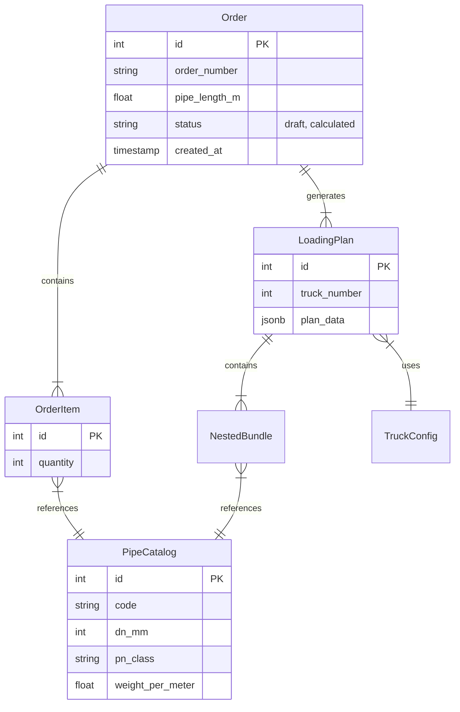

# Database Schema Documentation

## Overview
The application uses PostgreSQL with SQLAlchemy ORM. The schema is designed to support:
1.  Pipe Catalog management.
2.  Order processing and history.
3.  Complex loading plan storage (JSONB + Relational).
4.  System settings.

## Entity Relationship Diagram (ERD)

## Tables

### 1. `pipe_catalog`
Master data for all available HDPE pipes.

| Column | Type | Nullable | Description |
|--------|------|----------|-------------|
| `id` | Integer | No | Primary Key |
| `code` | String | No | Unique SKU (e.g., "TPE250/PN10/BR") |
| `dn_mm` | Integer | No | Nominal Diameter |
| `pn_class` | String | No | Pressure Class (PN6, PN10, PN16) |
| `sdr` | Integer | No | Standard Dimension Ratio |
| `inner_diameter_mm` | Float | No | Derived ID |
| `wall_mm` | Float | No | Wall thickness |
| `weight_per_meter` | Float | No | Weight (kg/m) |

### 2. `truck_configs`
Available truck types for loading.

| Column | Type | Nullable | Description |
|--------|------|----------|-------------|
| `id` | Integer | No | Primary Key |
| `name` | String | No | e.g. "Standard 24t Romania" |
| `max_payload_kg` | Integer | No | Default 24000 |
| `internal_length_mm` | Integer | No | Default 13600 |
| `internal_width_mm` | Integer | No | Default 2480 |
| `internal_height_mm` | Integer | No | Default 2700 |

### 3. `orders`
Customer loading orders.

| Column | Type | Nullable | Description |
|--------|------|----------|-------------|
| `id` | Integer | No | Primary Key |
| `order_number` | String | No | Unique UUID-based ref |
| `pipe_length_m` | Float | No | Length of pipes in this order (6-13m) |
| `status` | String | No | 'draft', 'processing', 'calculated', 'completed' |
| `total_weight_kg` | Float | Yes | Cached total weight |
| `total_pipes` | Integer | Yes | Cached total quantity |
| `created_at` | Timestamp | No | Creation time |
| `updated_at` | Timestamp | No | Last update |

### 4. `order_items`
Line items for each order.

| Column | Type | Nullable | Description |
|--------|------|----------|-------------|
| `id` | Integer | No | Primary Key |
| `order_id` | Integer | No | FK to orders |
| `pipe_id` | Integer | No | FK to pipe_catalog |
| `quantity` | Integer | No | Number of pieces |

### 5. `loading_plans`
Optimized loading results (one record per truck/plan).

| Column | Type | Nullable | Description |
|--------|------|----------|-------------|
| `id` | Integer | No | Primary Key |
| `order_id` | Integer | No | FK to orders |
| `truck_config_id` | Integer | No | FK to truck_configs |
| `truck_number` | Integer | No | Sequence number (1, 2, 3...) |
| `total_weight_kg` | Float | Yes | Weight on this truck |
| `volume_utilization` | Float | Yes | % Volume used |
| `plan_data` | JSONB | Yes | Full detailed placement logic |

### 6. `nested_bundles`
Physical bundles created by telescoping pipes.

| Column | Type | Nullable | Description |
|--------|------|----------|-------------|
| `id` | Integer | No | Primary Key |
| `loading_plan_id` | Integer | No | FK to loading_plans |
| `outer_pipe_id` | Integer | No | FK to pipe_catalog (The host pipe) |
| `inner_pipes` | JSONB | Yes | List of nested pipe IDs |
| `pack_count` | Integer | No | Number of identical bundles |
